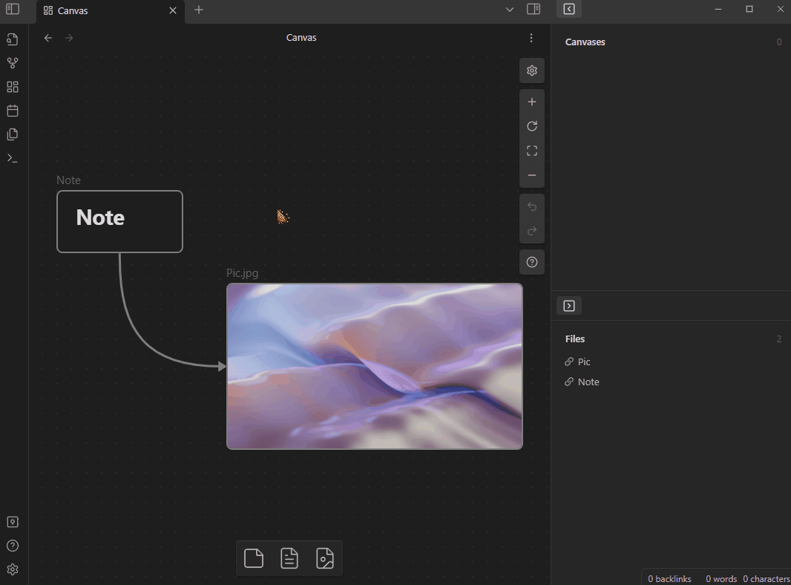

# Local Tags

Show all tags of the current markdown file. 

The plugin is available in [Obsidian Community Plugins](https://obsidian.md/plugins). After install, open command palette to enable this plugin, then the views will be default registered in the right panel. 

Wish you like it :)

